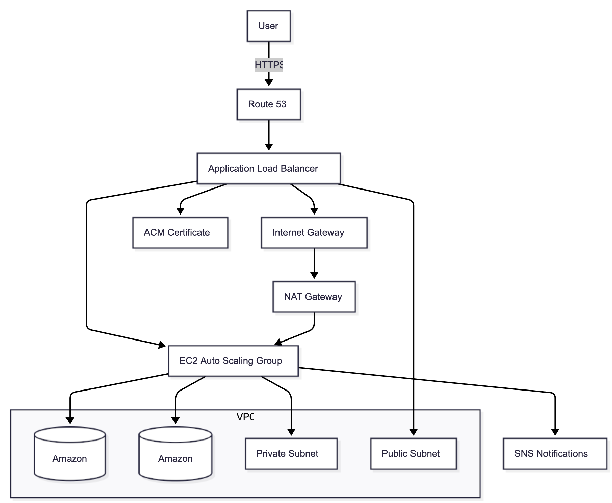

<div align="center">

# 🖥️ **Scalable WordPress Hosting on AWS**

<a href="https://aws.amazon.com/vpc/"></a>
<a href="https://aws.amazon.com/ec2/"></a>
<a href="https://aws.amazon.com/rds/"></a>
<a href="https://aws.amazon.com/efs/"></a>
<a href="https://aws.amazon.com/elasticloadbalancing/"></a>
<a href="https://wordpress.org/"></a>


<br/><br/>
**A secure, scalable, and production-ready WordPress deployment built entirely on AWS.**
</div>

---

## 🌐 **Architecture Overview**

This project hosts a WordPress site on AWS using a **secure, highly available, and scalable architecture** designed for real-world workloads.  

**Core Components**
- **VPC** with public/private subnets across two Availability Zones  
- **Internet Gateway** for external access  
- **Security Groups** to manage inbound/outbound traffic  
- **Public Subnets** for the NAT Gateway and ALB *(one NAT used — production would typically use two)*  
- **Private Subnets** for EC2 web servers for enhanced security  
- **EC2 Instance Connect Endpoint** for secure SSH  
- **Application Load Balancer (ALB)** with a target group  
- **Auto Scaling Group (ASG)** for dynamic EC2 scaling  
- **Amazon RDS** (MySQL) as a managed backend  
- **Amazon EFS** for shared storage across EC2 instances  
- **AWS Certificate Manager (ACM)** for SSL/TLS  
- **Amazon SNS** for scaling notifications  
- **Amazon Route 53** for DNS and domain routing  

<p align="center">
  
</p>

---

## 🌍 **Live Site Preview**

<p align="center">
  
</p>

---

## ⚙️ **Deployment Scripts**

### 📝 **WordPress EC2 Setup Script**

Used for manual WordPress provisioning — installs Apache, PHP, MySQL, mounts EFS, and configures permissions.

<details>
<summary>Click to expand</summary>

```bash
# Become root
sudo su

# Update system packages
sudo yum update -y

# Create web root
sudo mkdir -p /var/www/html

# Mount EFS
EFS_DNS_NAME=fs-064e9505819af10a4.efs.us-east-1.amazonaws.com
sudo mount -t nfs4 -o nfsvers=4.1,rsize=1048576,wsize=1048576,hard,timeo=600,retrans=2,noresvport "$EFS_DNS_NAME":/ /var/www/html

# Install Apache & PHP
sudo yum install -y httpd
sudo systemctl enable httpd && sudo systemctl start httpd
sudo dnf install -y php php-cli php-curl php-mysqlnd php-gd php-json php-xml php-zip php-mbstring php-intl php-fpm

# Install MySQL
sudo wget https://dev.mysql.com/get/mysql80-community-release-el9-1.noarch.rpm 
sudo dnf install -y mysql80-community-release-el9-1.noarch.rpm 
sudo rpm --import https://repo.mysql.com/RPM-GPG-KEY-mysql-2023
sudo dnf install -y mysql-community-server 
sudo systemctl enable mysqld && sudo systemctl start mysqld

# Permissions
sudo usermod -a -G apache ec2-user
sudo chown -R ec2-user:apache /var/www
sudo chmod 2775 /var/www && find /var/www -type d -exec sudo chmod 2775 {} \;
sudo find /var/www -type f -exec sudo chmod 0664 {} \;
sudo chown apache:apache -R /var/www/html

# Install WordPress
wget https://wordpress.org/latest.tar.gz
tar -xzf latest.tar.gz
sudo cp -r wordpress/* /var/www/html/
sudo cp /var/www/html/wp-config-sample.php /var/www/html/wp-config.php

# Restart Apache
sudo service httpd restart

exit

</details>
📦 Auto Scaling Group Launch Template Script
Bootstraps EC2 instances automatically via ASG launch templates.
<details> <summary>Click to expand</summary>
#!/bin/bash
sudo yum update -y
sudo yum install -y httpd
sudo systemctl enable httpd && sudo systemctl start httpd

# PHP installation
sudo dnf install -y php php-cli php-curl php-mysqlnd php-gd php-json php-xml php-zip php-mbstring php-intl php-fpm

# MySQL setup
sudo wget https://dev.mysql.com/get/mysql80-community-release-el9-1.noarch.rpm 
sudo dnf install -y mysql80-community-release-el9-1.noarch.rpm 
sudo rpm --import https://repo.mysql.com/RPM-GPG-KEY-mysql-2023
sudo dnf install -y mysql-community-server 
sudo systemctl enable mysqld && sudo systemctl start mysqld

# Mount EFS
EFS_DNS_NAME=fs-02d3268559aa2a318.efs.us-east-1.amazonaws.com
echo "$EFS_DNS_NAME:/ /var/www/html nfs4 nfsvers=4.1,rsize=1048576,wsize=1048576,hard,timeo=600,retrans=2 0 0" >> /etc/fstab
mount -a

# Set permissions
sudo chown apache:apache -R /var/www/html

# Restart Apache
sudo service httpd restart
</details>
🚀 How to Use
# Clone repository
git clone https://github.com/your-username/your-repo.git
cd your-repo

# Provision AWS infrastructure

# (via AWS Console, CLI, or Terraform)
Then:
Deploy WordPress → SSH into EC2 and run the setup script.
Attach instance → Add to ALB target group.
Test the site → Access ALB DNS name in browser.
📬 Contributing
Contributions are welcome!
Fork this repository, make your improvements, and submit a pull request 🚀
📚 AWS Reference Documentation
Service	Documentation
Amazon VPC	Networking & subnet design
NAT Gateways	Outbound traffic control
Security Groups	Instance traffic filtering
EC2	Compute service
RDS	Managed MySQL database
EFS	Shared file storage
Elastic Load Balancing	Traffic distribution
Auto Scaling	Elastic scaling
Certificate Manager	SSL/TLS management
SNS	Notifications
Route 53	DNS management
AWS Blog: Hosting WordPress	Best practices
<div align="center"> <sub>© 2025 Tristan Jones — Cloud / DevOps Engineer</sub> </div> ```
